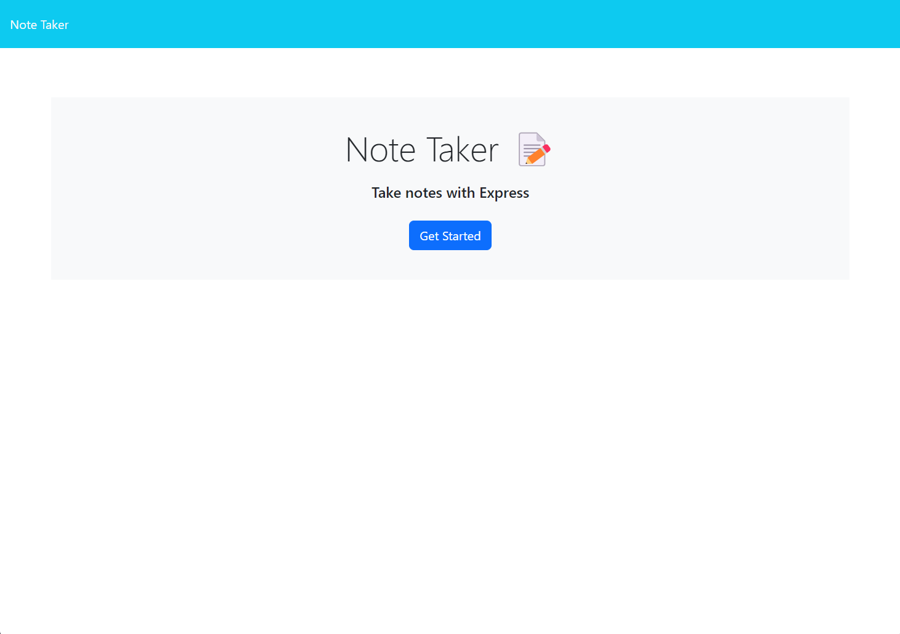

# Take-Note

## License

MIT License

## Screenshot

## Deployment

https://dry-sea-56833-cb76eedf7782.herokuapp.com/

## Description

This is an app that saves personal notes for you. This app runs with Express.js in the back end and builds api that saves and retrieves your notes that are stored in json format in the database. You can also easily manage your note list by deleting messages from the database from the web page.

## Installation

You will need to run: npm install in your terminal to have all the required packages.

## Questions

If you have any questions feel free to contact me via email: robertcoulson91@gmail.com you can also view more of my projects at https://github.com/RobertC91.